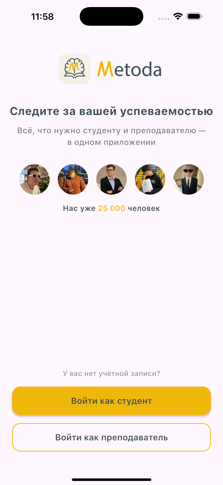
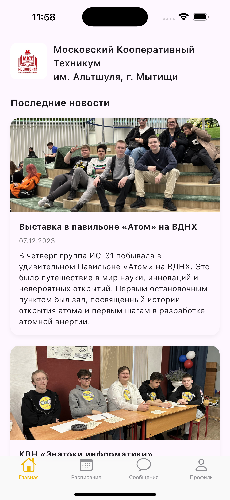
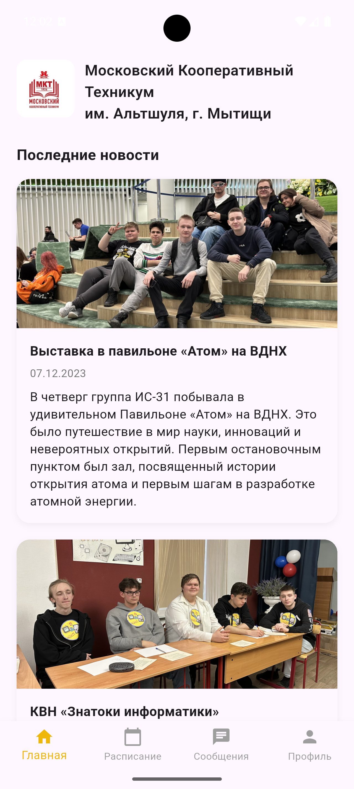
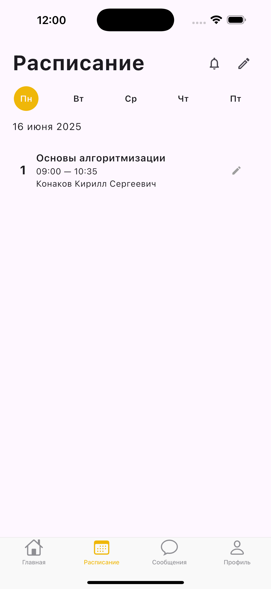
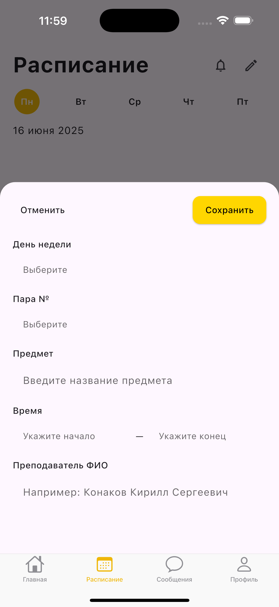
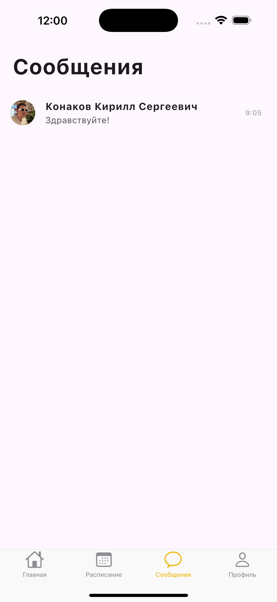
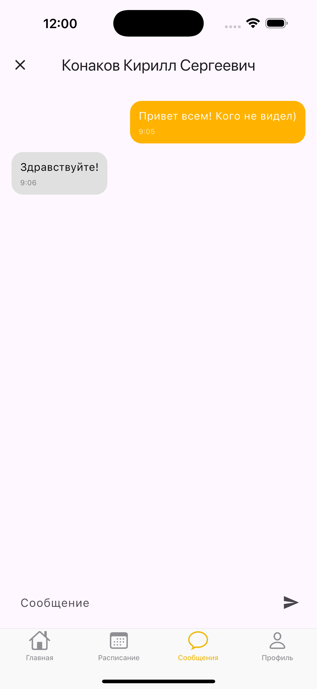
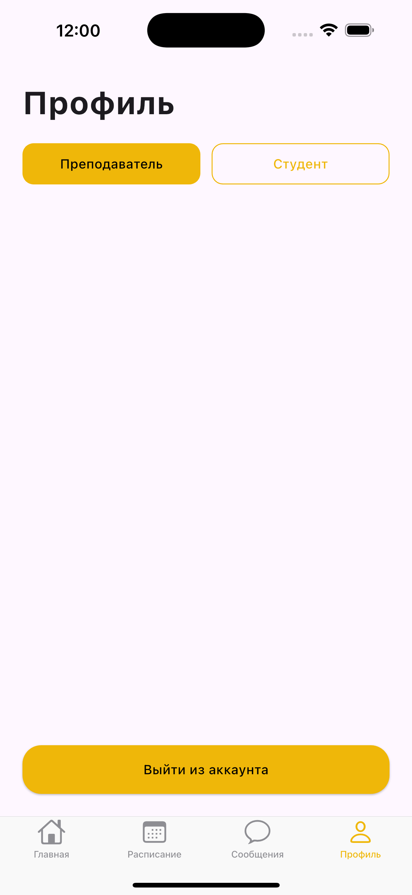

  

# Metoda

Мобильное приложение для студентов и преподавателей колледжа. Предназначено для удобного взаимодействия: просмотр расписания, новостей, переписка и управление профилем.

## 📱 Платформы

- ✅ Android (.apk)
- ✅ iOS (.ipa)

## ⬇️ Скачать

[Перейти к релизу](https://github.com/kerloman/metoda/releases)

## ⚙️ Основные возможности

- 👤 Регистрация с выбором роли (Студент / Преподаватель)
- 📅 Просмотр и редактирование расписания
- 📰 Новости колледжа
- 💬 Чат между студентами и преподавателями с уведомлениями
- ⚙️ Профиль с возможностью смены роли
- 🌙 Поддержка светлой и тёмной темы

## 🛠️ Используемые технологии

- Flutter + Dart
- Shared Preferences
- Flutter Local Notifications
- Android SDK / iOS SDK

## 🖼️ Скриншоты приложения

### 🌞 Регистрация (светлая тема)

  

### 🌙 Регистрация (тёмная тема)

  

### 🏠 Главная (iOS)

  

### 🏠 Главная (Android)

  

### 📅 Расписание

  

### ✏️ Редактирование расписания

  

### 💬 Сообщения (Преподаватель)

  

### 💭 Оформление чата

  

### 🙋‍♂️ Профиль

  

---

📌 Разработка и дизайн: [@kerloman](https://github.com/kerloman)